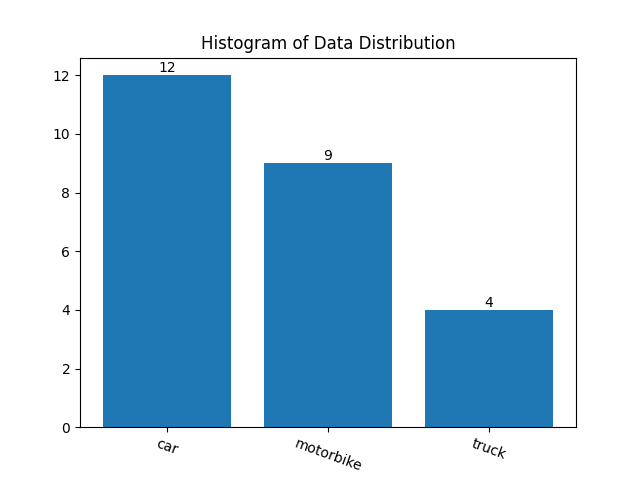

# Parse-VOC-dataset-operate

Parse VOC dataset annotation file is `xml` format.

You can use annotation tool such as [labelImg](https://github.com/HumanSignal/labelImg) to get the xml.

This tool can quickly adjust the Parse-VOC-dataset, it can help you `replace label` and `remove label` in the same time.

Provide statistical data for each label and draw it into a histogram so that you can clearly understand the distribution of the data.

## statistical data

```
python statisticalData.py --xmlPath <your xmlFolder Path> --save True
```
- generate the `original.txt`

```
motorbike
car
truck
```
- generate the `Distribution.png`



## adjust dataset
create two txt files
- `original.txt`: It can generate by `statisticalData.py`.
```
motorbike
car
truck
```
- `new.txt`: It can help you `replace label` and `remove label`.

replace label just modify.

remove label using `blank line`.

```
motorcycle

truck
```
run code 
```
python vocDataset.py --xmlPath <your xmlFolder Path> --originalClass *.txt --newClass *.txt
```


